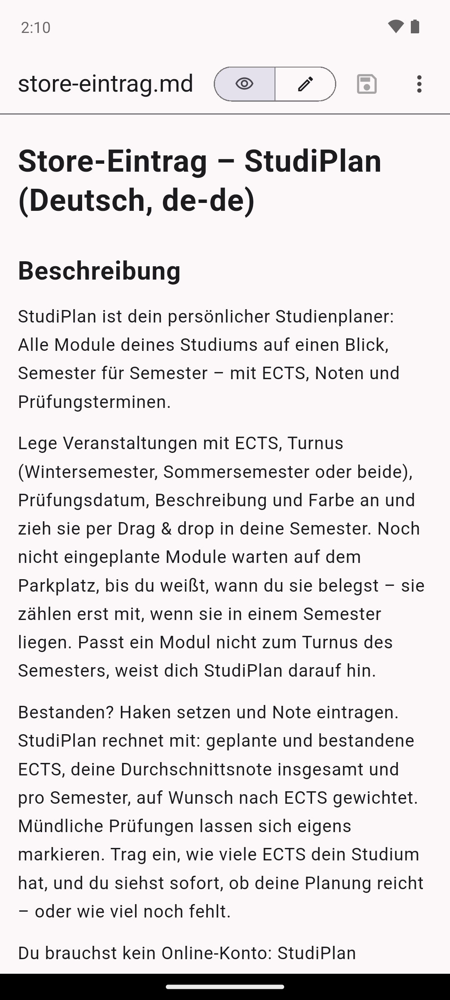
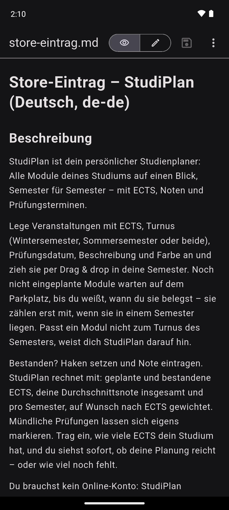

# Basic Markdown Viewer

A small Android app for reading and editing Markdown (`.md`) files. It shows up as an
**"Open with"** option for Markdown files in file managers, mail apps and so on.

<p>
  
  
  
</p>
<p>
  
</p>

Screenshots are taken automatically on an Android emulator by `.github/workflows/screenshots.yml`.

## Features

Modes at the top, plus split view on wide screens:

| Mode | What it does |
| --- | --- |
| 👁 **Preview** | The rendered document (text is selectable) |
| ✎ **Edit** | The raw Markdown, editable, with a formatting bar |
| ◫ **Split** *(tablet / landscape)* | Editor and live preview side by side |

- **Formatting bar** below the editor: undo/redo, heading (# → ## → ### → none), bold,
  italic, strikethrough, code, link, bulleted/numbered list, checklist, quote, code block,
  table, horizontal line. Applies to the selection, or inserts an empty template.
- **Search** (🔍, Ctrl+F): highlights all hits in the editor and the preview, ↑/↓ jump between
  them and scroll there.
- **Split view**: scrolling one side scrolls the other (*Sync scrolling* in ⋮); tapping a
  paragraph in the preview puts the editor cursor there.

- GitHub Flavored Markdown: headings, lists, task lists, tables, code blocks, quotes,
  strikethrough, links (open in the browser). Images are shown as placeholders.
- Open from other apps ("Open with" for `.md` / `.markdown`), share sheet, *Open file*,
  *New*, *Save*, *Save as…*, *Copy all*, *Sample*
- **Print / Save as PDF** (⋮): the system print dialog with the document rendered as a clean,
  light page (real text, clickable links); choose "Save as PDF" or a printer
- Asks before throwing away unsaved changes; `•` next to the file name marks unsaved changes
- A− / A+ text size, light and dark theme
- German or English, following the system language (texts in `lib/l10n/*.arb`)
- Ctrl+S / Ctrl+O with a hardware keyboard
- ⋮ → *About*: version, link to this repository, open-source licenses

## How it works

| Part | File |
| --- | --- |
| Intent filters (`text/markdown`, `*.md`, share sheet) | `android/app/src/main/AndroidManifest.xml` |
| Reading intents, SAF open / save as, writing back, opening links, printing | `android/app/src/main/kotlin/com/nicolas/markdown_viewer/MainActivity.kt` |
| Platform channel `markdown_viewer/file` (Dart side) | `lib/src/file_bridge.dart` |
| Screen, modes, save / discard logic | `lib/src/viewer_page.dart` |
| Rendered preview (block by block), search highlight, styles | `lib/src/markdown_preview.dart` |
| Splitting the source into blocks (preview ↔ source mapping), search | `lib/src/markdown_blocks.dart` |
| Editor, formatting bar, search highlight | `lib/src/markdown_editor.dart` |
| Formatting actions (pure text edits) | `lib/src/markdown_format.dart` |
| Markdown → print-friendly HTML (PDF export) | `lib/src/print_html.dart` |
| About dialog, app name and version | `lib/src/about.dart` |
| Translations (German / English), generated with `flutter gen-l10n` | `lib/l10n/` |

Rendering uses [`flutter_markdown_plus`](https://pub.dev/packages/flutter_markdown_plus).
File access goes through the Android Storage Access Framework directly (no plugins), so a
file opened via *Open file* or *Save as* stays writable.

## Icon

The launcher icon is defined in `tool/icon/icon.svg`:

- adaptive icon (API 26+, including the themed/monochrome variant):
  `res/drawable/ic_launcher_{background,foreground,monochrome}.xml`, `res/mipmap-anydpi-v26/ic_launcher.xml`
- `res/mipmap-*/ic_launcher.png` for older Android versions
- store icon `store/icon-512.png` and feature graphic `store/feature-graphic.png`
  (from `tool/icon/feature.html`): `node tool/icon/render.js` (needs Playwright)

## Google Play

- Store texts (de/en), data safety answers and checklist: `store/listing.md`
- Privacy policy: `PRIVACY.md`
- Upload the `.aab` from the `markdown-viewer-aab` build artifact, signed with your upload key
  (see below). Bump `version` in `pubspec.yaml` *and* `appVersion` in `lib/src/about.dart`
  for each release (a test checks they match).

## Build

```sh
flutter test
flutter build apk --release --split-per-abi
```

GitHub Actions:

- `build.yml`: analyze, tests, split APKs and an App Bundle (`.aab`) as artifacts
- `screenshots.yml`: starts an Android emulator, opens `tool/screenshots/sample.md` via a
  real VIEW intent and commits phone and tablet screenshots to `docs/screenshots/`

### Release signing

Without secrets the release build is signed with the debug key. To sign with your
upload key, add these repository secrets (*Settings → Secrets and variables → Actions*):

| Secret | Value |
| --- | --- |
| `KEYSTORE_BASE64` | `base64 -w0 upload-keystore.jks` |
| `KEYSTORE_PASSWORD` | keystore password |
| `KEY_ALIAS` | key alias |
| `KEY_PASSWORD` | key password (optional, defaults to `KEYSTORE_PASSWORD`) |

Locally, create `android/key.properties` (git-ignored) with `storeFile`, `storePassword`,
`keyAlias`, `keyPassword`.

Note: to install over the old build (`com.nicolas.markdown_viewer`) without uninstalling,
the APK must be signed with the same key as before.

## License

[MIT](LICENSE)
